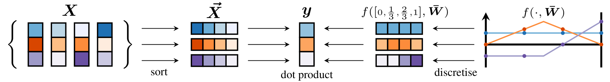

# FSPool: Featurewise sort pooling



This is the official implementation of our paper [FSPool: Learning Set Representations with Featurewise Sort Pooling][0] in PyTorch.
We propose a pooling method for sets of feature vectors that allows deep neural networks to learn better set representations, classification results and convergence speed.
You can take a look at the [poster for the NeurIPS 2019 Workshop on Sets & Partitions][2].

We also analyse why existing set auto-encoders struggle to auto-encode some very simple sets and attribute this to a responsibility problem.
FSPool can be used to construct a permutation-equivariant auto-encoder, which avoids this problem and results in much better reconstructions and representations.

The main algorithm is located in the stand-alone [`fspool.py`][1] file in this top-level directory, which is the only file you need if you want to use FSPool.
The only dependency for this is PyTorch 1.0 or newer.
Please refer to the READMEs in the `auto-encoder` and `clevr` directories for instructions on reproducing the individual experiments in the paper.

## BibTeX entry

```
@Article{Zhang2019FSPool,
  author        = {Yan Zhang and Jonathon Hare and Adam Pr\"ugel-Bennett},
  title         = {{FSPool}: Learning Set Representations with Featurewise Sort Pooling},
  year          = {2019},
  eprint        = {1906.02795},
  url           = {https://arxiv.org/abs/1906.02795}
}
```


## File structure

Here, we list the files and their purposes that are included in this folder.

- fspool.py: Main model file

### Auto-encoder
- data.py: Polygon and MNISTSet Dataset loaders
- fspool.py: FSPool and FSUnpool model
- model.py: Encoder and Decoder models for the Set auto-encoder (`SAE` class)
- plot-dataset.py: Script to plot an example of a set in one of the two datasets
- plot-mnist.py: Plots inputs and reconstructions on MNIST.
- track.py: Helpers for keeping track of training losses
- train.py: Main training script, see `--help` for details
- summarise-mnist.py: Compute mean and stdev classification results
- summarise-mnist-reconstruction.py: Compute mean and stdev reconstruction results

- polygon-experiment.sh: Script for running all the Polygon experiments with different set sizes in sequence
- noise-experiment.sh: Script for running all the MNIST reconstruction experiments with different noise levels in sequence
- noise-experiment.sh: Script for running all the MNIST reconstruction experiments (masked version) with different noise levels in sequence
- classify-experiment.sh: Script for running all the MNIST classification with noise=0.05 in sequence
- classify-nonoise-experiment.sh: Script for running all the MNIST classification with noise=0.00 in sequence

### CLEVR
This code is built on top of https://github.com/mesnico/RelationNetworks-CLEVR .
We list only the parts that we added or changed.

- clevr.job: SLURM job script to submit a training job of a model with a specified seed. We used seeds 0 to 9 inclusive for all three models.
- config.json: Hyperparameters for the all the models we evaluate
- fspool.py: FSPool model
- model.py: Modified model definitions that supports the RN, sum, and FSPool variants
- plot-functions.py: Plots the learned piecewise linear functions of trained FSPool model
- ratio.py: Prints out the sparsity ratios from a directory of training checkpoints.
- sparsity.py: Plots the sparsity ratios from ratio.py
- summary.py: Summarises the results from a bunch of log files, used to produce the two CLEVR tables
- train.py: Main training script


### Graphs
This code is built on top of https://github.com/rusty1s/pytorch_geometric .
Because their code was still in alpha and undergoing frequent changes at the time when the experiments were done, we bundle the exact version we used in this directory.
We list only the parts that we added or changed.

- torch_geometric/nn/pool/fs_pool.py: Class that interfaces between the FSPool pooling and the graph library, providing the pooling operator
- torch_geometric/nn/pool/fsort.py: FSPool model
- experiments/train.py: Main training script, see `--help` for options.
- experiments/schedule.py: Scheduling script that calls `train.py` with the defined hyperparameter sweep. This schedules runs onto all available local GPUs.
- experiments/summary.py: Summarises the many log files that this creates for each run into several tables. This is used to produce the graph classification table.
- experiments/\*.job: Several SLURM job scripts to run either the bioinformatics or the social network datasets with a specified seed. The seeds used were 0 to 9 inclusive for the two models.


### DSPN
This code is built on top of https://github.com/Cyanogenoid/dspn .
We list only the parts that we added or changed.

- model.py: Modified to include a pure RN (RN + sum) and RN + max baseline
- scripts/\*.sh: Modified to use these two models


## Requirements

### Auto-encoder
- PyTorch 1.0+
- scipy
- torchvision
- numpy
- matplotlib
- tqdm
- pandas

### CLEVR
- PyTorch 0.3.1
- See the CLEVR/README.md for further installation instructions

### Graphs
Output of pip list:

    certifi           2018.11.29
    cffi              1.11.5
    decorator         4.3.0
    GPUtil            1.3.0
    meson             0.46.1
    mkl-fft           1.0.6
    mkl-random        1.0.2
    networkx          2.2
    numpy             1.15.4
    olefile           0.46
    Pillow            5.3.0
    pip               18.1
    plyfile           0.6
    pycparser         2.19
    scikit-learn      0.20.1
    scipy             1.1.0
    setuptools        40.6.2
    six               1.12.0
    sklearn           0.0
    torch             1.0.0
    torch-cluster     1.2.1
    torch-geometric   1.0.0
    torch-scatter     1.1.0
    torch-sparse      0.2.3
    torch-spline-conv 1.0.5
    torchvision       0.2.1
    tqdm              4.28.1
    wheel             0.32.3

Note that you should install the torch-geometric code in the graphs directory with `pip install .`, as things may have changed in newer versions of it.

### DSPN
- PyTorch 1.1+
- torchvision
- numpy
- scipy
- tqdm
- tensorboardX
- pillow
- h5py
- matplotlib


[0]: https://arxiv.com/abs/1906.02795
[1]: https://github.com/Cyanogenoid/fspool/blob/master/fspool.py
[2]: https://www.cyanogenoid.com/files/fspool-workshop-poster.pdf
